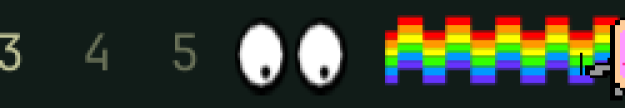

# Eyes for Omarchy

[xeyes](https://gitlab.freedesktop.org/xorg/app/xeyes), in the
[Omarchy](https://omarchy.org) bar, following the pointer across every monitor.
Plugin ID: `jesusarchive.eyes`. MIT licensed.



The eyes are not a redraw from memory. The rim thickness, the white, the pupil
and how far it travels are the constants out of x.org's `Eyes.c`, and the
pupil's position is `computePupil()` ported line for line:

| Constant | Value | What it is |
|---|---|---|
| `EYE_THICK` | `0.175` | thickness of the rim |
| `EYE_DIAM` | `1.45` | the white of the eye |
| `BALL_DIAM` | `0.3` | the pupil |
| `BALL_DIST` | `0.4` | how far the pupil travels from the centre |
| `EYE_OFFSET` | `0.1` | padding between the two eyes |

They are egg-shaped for the same reason the real ones are: xeyes maps its
3.8 × 1.8 bounding box onto the window with a separate scale per axis, so its
default 150 × 100 window stretches the circles vertically by 1.407. Set `shape`
to `round` to opt out.

- Follows the pointer anywhere on any monitor, not only over the bar.
- Goes cross-eyed when the pointer is closer than the pupil can travel, like
  the original.
- Turns a quarter turn on a vertical bar, and the pupils keep aiming at the
  real cursor.
- Costs nothing while the cursor is still: unchanged positions are never sent.

## Following the cursor on Wayland

Under X11 any client could ask the server where the pointer was, which is how
xeyes watched a cursor nowhere near its own window. Wayland deliberately does
not allow that — a client gets pointer events only while the pointer is over
its own surface — so the eyes ask the compositor instead. `cursor-tracker.py`
polls Hyprland's `cursorpos` on its request socket and streams changes to the
widget.

That costs about 30µs per sample, against roughly 4ms to spawn `hyprctl` for
the same answer, which is why it is a small resident helper rather than a
shell loop. It needs `/usr/bin/python3`, and nothing else.

## Install

```bash
omarchy plugin add https://github.com/jesusarchive/omarchy-eyes.git --enable
```

Manual install from a checkout:

```bash
omarchy plugin validate .
mkdir -p ~/.config/omarchy/plugins/jesusarchive.eyes
rsync -a --delete --exclude .git ./ ~/.config/omarchy/plugins/jesusarchive.eyes/
omarchy plugin enable jesusarchive.eyes left
```

Move it with `omarchy bar move jesusarchive.eyes --section <left|center|right>`,
and take it off the bar with `omarchy plugin disable jesusarchive.eyes`.
Shell plugins hot-reload, so code edits land without a restart — but a widget
already on the bar keeps the instance it was built from, so run
`omarchy restart shell` when a change does not show up.

## Settings

Set them with `omarchy bar set jesusarchive.eyes <key> <value>`, or from the
bar widget settings panel.

| Key | Default | What it does |
|---|---|---|
| `fps` | `60` | Cursor samples per second. |
| `size` | `0` | Height of the eyes in pixels. `0` fits them to the bar. |
| `shape` | `stretched` | `stretched` for the shape xeyes gives its eyes, `round` for circles. |
| `distance` | `Off` | xeyes' `-distance`: pupil travel scales with how far across the screen the cursor is. |
| `outline` | `""` | Rim colour. Empty is xeyes' black; `theme` follows the bar. |
| `center` | `""` | The white of the eye. Empty is xeyes' white; `theme` follows the bar. |
| `pupil` | `""` | Pupil colour. Empty is xeyes' black; `theme` follows the bar. |
| `onClick` | `""` | Shell command to run on left click. |

```bash
omarchy bar set jesusarchive.eyes distance On
omarchy bar set jesusarchive.eyes shape round
omarchy bar set jesusarchive.eyes pupil theme
```

## Credit

xeyes is part of X.Org, written by Keith Packard and Jim Gettys, and the eyes
are theirs. The geometry and pupil math here are ported from `Eyes.c`; the MIT
licence in `LICENSE` covers this plugin's code. The Xfce panel had the same
idea for years as `xfce4-eyes-plugin`.
